## Проект Mobile автотестов для приложения Wikipedia

<!-- Технологии -->

### Используемые технологии

  <code></code>
  <code></code>
  <code></code>
  <code></code>
  <code></code>
  <code></code>
  <code></code>
  <code></code>
  <code></code>
  <code></code>
  <code></code>
  <code></code>
  <code></code>

<!-- Тест кейсы -->

### Что проверяют тесты
1. test search successfully
2. test open article
3. test open article categories
4. test login with invalid data
5. test login successfully

##### Видео прохождение теста на эмуляторе
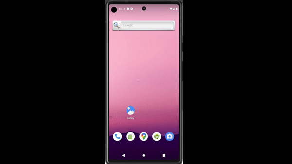

##### Видео прохождение теста в Browserstack
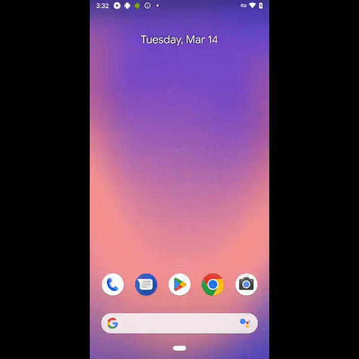

<!-- Jenkins -->

###   Запуск проекта в Jenkins
### [Job](https://jenkins.autotests.cloud/job/kudaev-wikipedia-mobile/)
##### При нажатии на "Собрать сейчас" начнется сборка тестов и их прохождение на сервере jenkins.
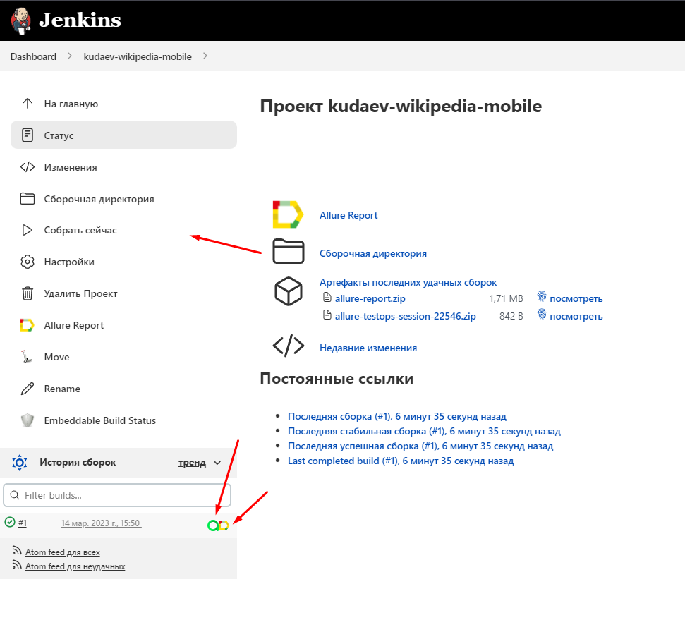

Также мы можем посмотреть выполнение тестов в консоли перейдя во вкладку "Вывод консоли" у определенного билда
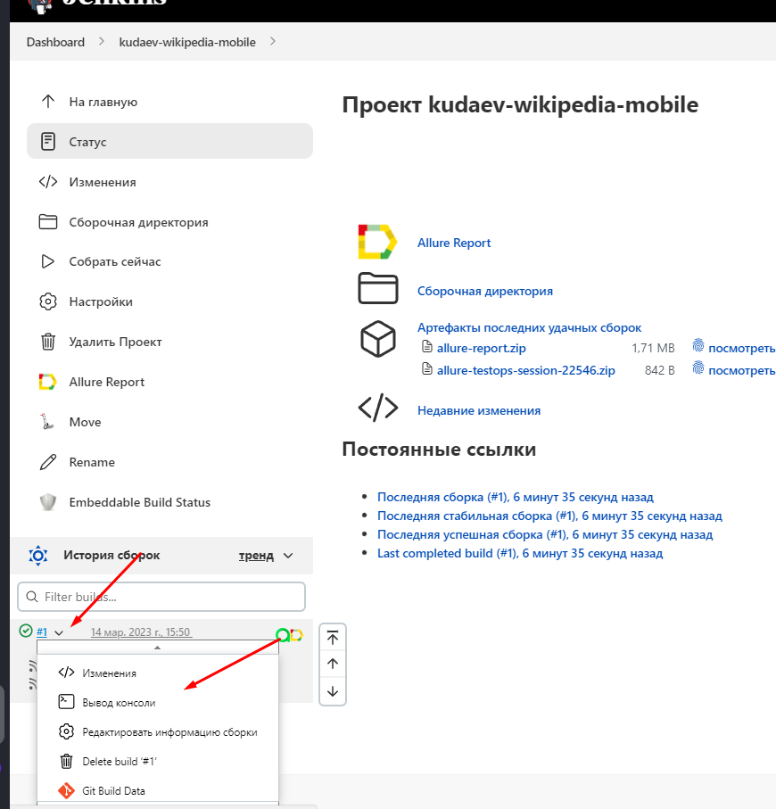

<!-- Browserstack -->

###  Запуск проекта в [Browserstack](https://app-automate.browserstack.com/dashboard/v2/builds/be982c566cce4ce727bba8deb0155db9b6cdbcb2/sessions/456557888aad153346a3d5cfb8d1ee56f4d3b642)
##### После запуска сборки в Jenkins, тесты начинают проходить удаленно через Browserstack. Где в реальном времени можно следить за прохождением теста через логи.

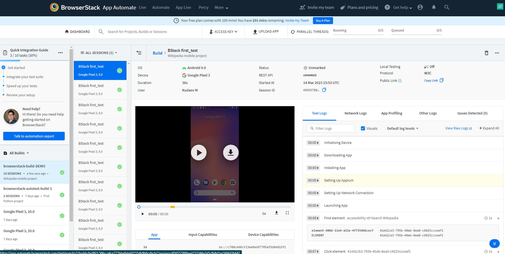

<!-- Allure report -->

###  Allure report

##### После прохождения тестов, результаты можно посмотреть в Allure отчете, где так же содержится ссылка на Jenkins
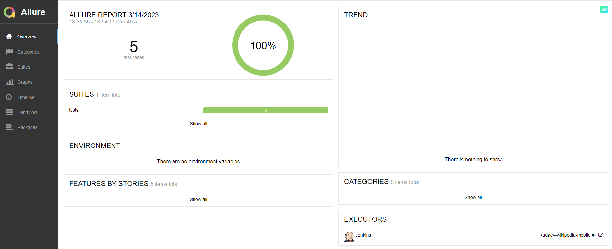

##### Во вкладке Graphs можно посмотреть графики о прохождении тестов, по их приоритезации, по времени прохождения и др.
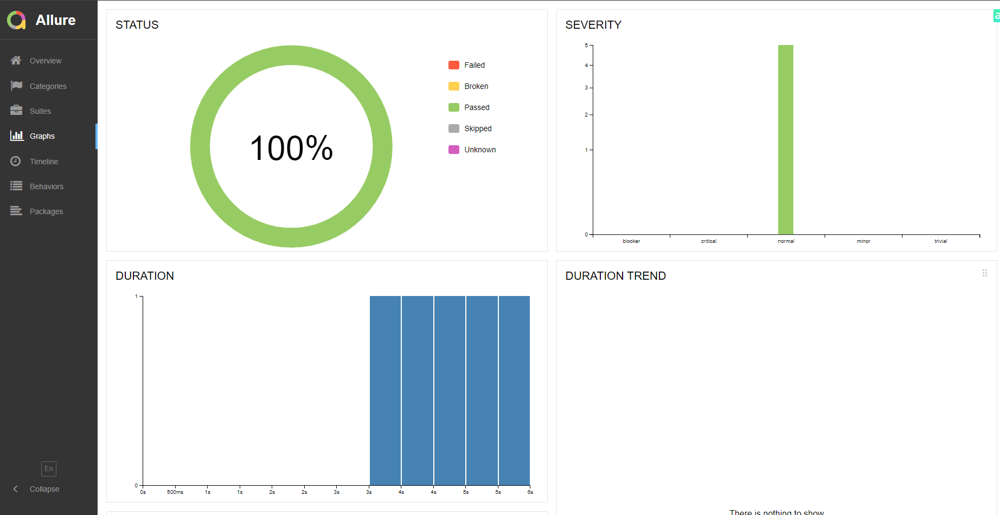

##### Во вкладке Suites находятся собранные тест кейсы, у которых описаны шаги и приложены логи, скриншот и видео о прохождении теста
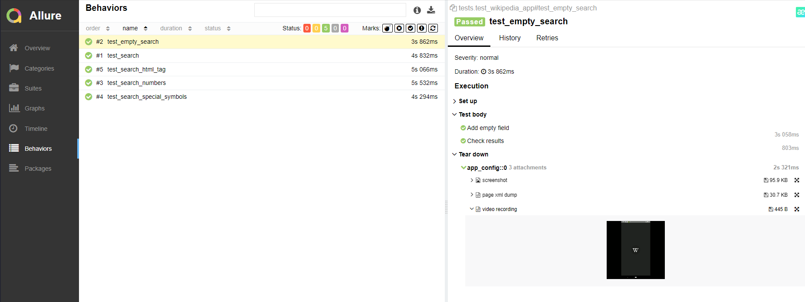

<!-- Allure TestOps -->

###  Интеграция с Allure TestOps

### [Dashboard](https://allure.autotests.cloud/project/2027/dashboards)

##### Так же вся отчетность сохраняется в Allure TestOps, где строятся аналогичные графики.
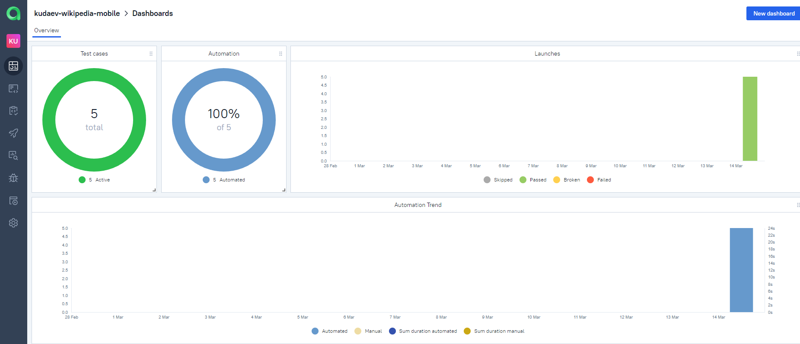

#### Во вкладке со сьютами, мы можем:
- Управлять всеми тест-кейсами или с каждым отдельно
- Перезапускать каждый тест отдельно от всех тестов
- Настроить интеграцию с Jira
- Добавлять ручные тесты и т.д

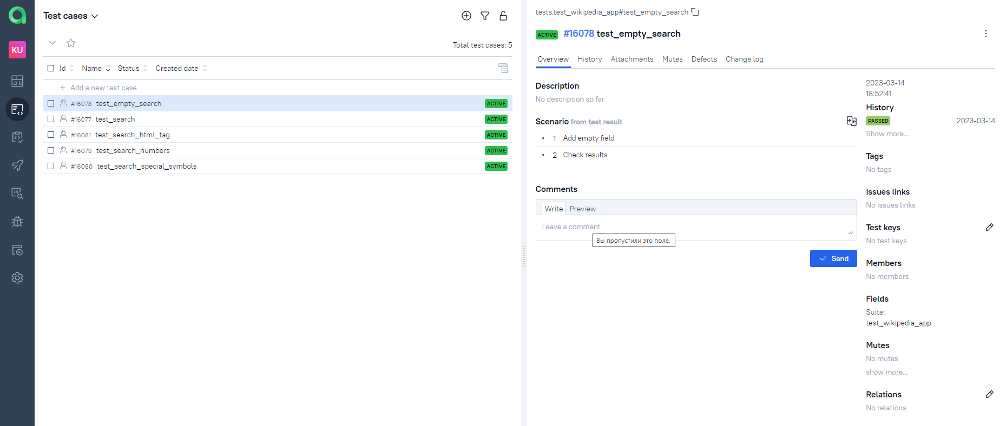

Во вкладке Launches мы можем видить тестовые прогоны:
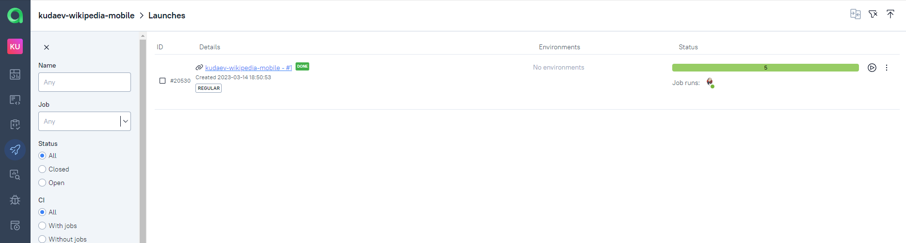

<!-- Jira -->

###  Интеграция с Jira
##### Настроив через Allure TestOps интеграцию с Jira, в тикет можно пробросить результат прохождение тестов и список тест-кейсов из Allure

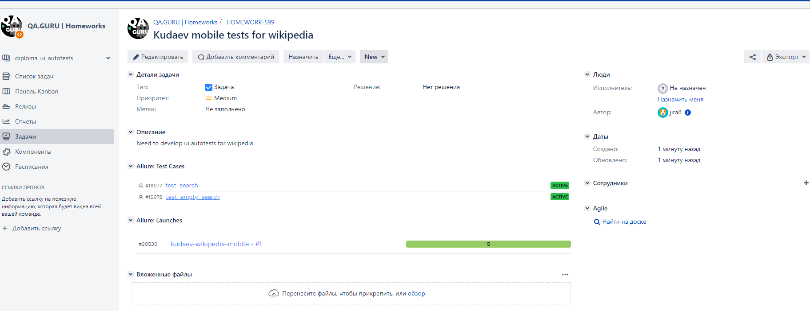

<!-- Telegram -->

###  Интеграция с Telegram
##### После прохождения тестов, в Telegram bot приходит сообщение с графиком и небольшой информацией о тестах.

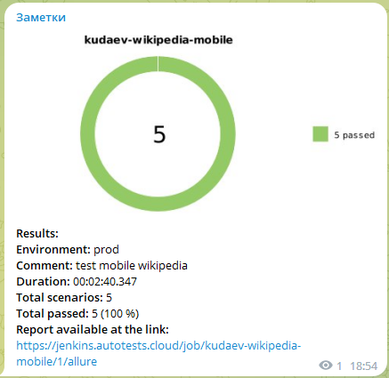
